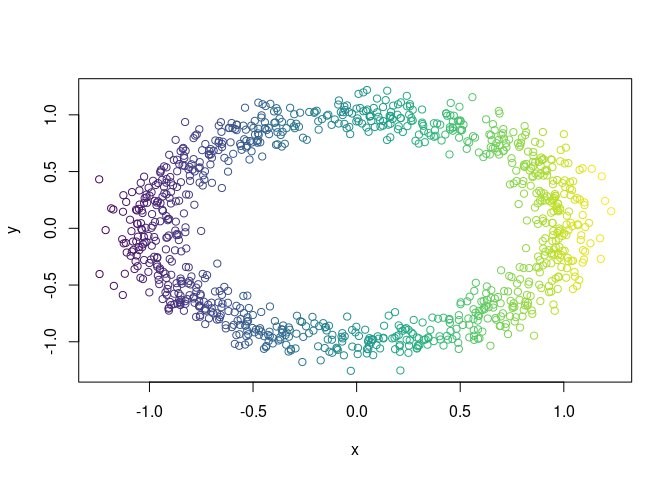
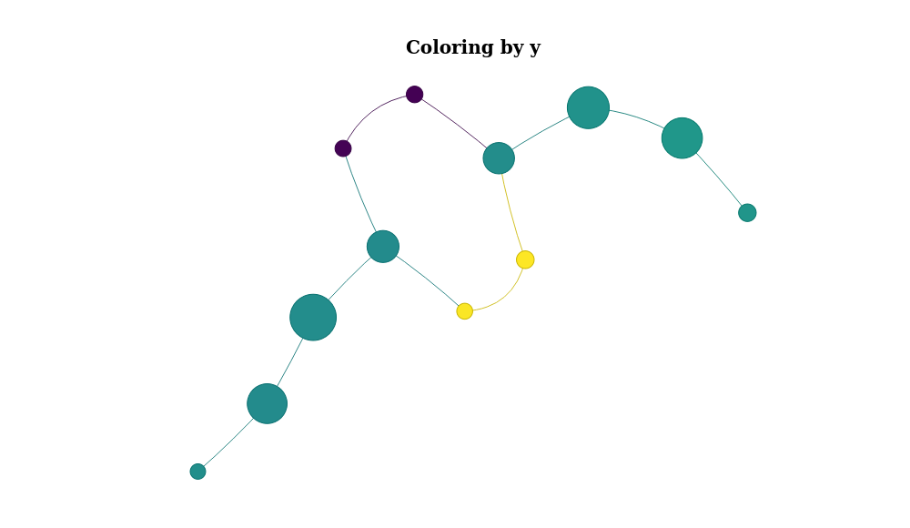

<!-- README.md is generated from README.Rmd. Please edit that file -->

# TDAtools

<!-- badges: start -->
<!-- badges: end -->

TDAtools provides many functions to help data scientists using TDA.

## Installation

You can install the development version of TDAtools from
[GitHub](https://github.com/) with:

``` r
devtools::install_github("vituri/TDAtools")
```

## Notation

Let’s fix some notation:

-   `X` is a data.frame with possibly factor columns. When needed, we
    select only the numeric columns (like when calculating the distance
    matrix of `X`) and denote it by $X$. The rows of `X` are called
    observations, and the columns are called variables;

-   `f_X` is a vector with one number for each observation of `X`. That
    is: `f_X` is the result of applying a *filter function*
    $f: X \to \mathbb{R}$ to `X`. We provide many filter functions;

-   `distance_matrix` is a matrix of distances calculated with `X` OR a
    function that when applied to `X` results in such a matrix

## Graph-reducing algorithms

We provide the Mapper algorithm and the Ball Mapper algorithm. Both
return a list consisting of:

-   a graph with weighted vertices;

-   a list showing which points of `X` are in each vertex.

## Examples

Let `X` be a sample of random points in a noisy circle:

``` r
library(TDAtools)
#> Carregando pacotes exigidos: shiny
#> Carregando pacotes exigidos: dplyr
#> 
#> Attaching package: 'dplyr'
#> The following objects are masked from 'package:stats':
#> 
#>     filter, lag
#> The following objects are masked from 'package:base':
#> 
#>     intersect, setdiff, setequal, union
#> Carregando pacotes exigidos: purrr
#> Carregando pacotes exigidos: ggplot2

X = data.noisy_circle()
```

Let the filter function be the projetion on the x-axis and let color `X`
using it:

``` r
f_X = X$x

color_band = ggplot2::cut_interval(f_X, n = 50)
col_vector = viridis::viridis(nlevels(color_band))[as.integer(color_band)]
plot(X, col = col_vector)
```



Now we embed `X` in $R^4$:

``` r
X$z = 0
X$w = 0
```

and calculate its Mapper Graph:

``` r
mp =
  mapper(
    X = X
    ,f_X = f_X
  )
#> Clustering pullback 1...
#> Clustering pullback 2...
#> Clustering pullback 3...
#> Clustering pullback 4...
#> Clustering pullback 5...
#> Clustering pullback 6...
#> Clustering pullback 7...
#> Clustering pullback 8...
#> Clustering pullback 9...
#> Clustering pullback 10...
```

The result is a list with many objects. For example, the pullback of
each interval in the covering:

``` r
mp$pullback |> str()
#> List of 10
#>  $ 1 : int [1:114] 25 45 57 58 74 86 104 115 119 132 ...
#>  $ 2 : int [1:257] 25 26 27 45 47 57 58 62 70 74 ...
#>  $ 3 : int [1:255] 4 6 16 20 26 27 28 31 34 47 ...
#>  $ 4 : int [1:180] 4 6 16 18 20 22 24 28 31 34 ...
#>  $ 5 : int [1:168] 1 8 9 18 22 24 30 33 43 48 ...
#>  $ 6 : int [1:182] 1 8 9 10 19 30 33 48 75 78 ...
#>  $ 7 : int [1:202] 2 7 10 11 15 19 21 29 32 39 ...
#>  $ 8 : int [1:281] 2 5 7 11 13 14 15 21 29 32 ...
#>  $ 9 : int [1:260] 3 5 12 13 14 17 23 35 36 37 ...
#>  $ 10: int [1:100] 3 12 17 23 36 37 44 51 52 61 ...
#>  - attr(*, "class")= chr "AsIs"
```

Let’s plot the mapper graph:

``` r
mp$graph %>% plot()
```


Or, for a better visualization, we use the `networkVis` package and
color the nodes using the mean value of the `x` variable of `X`:

``` r
mp %>% plot_mapper()
```


Or color it by `y`:

``` r
mp %>% plot_mapper(data_column = 'y')
```



## To do

-   Vignettes using mapper with factor variables
-   Ball Mapper documentation
-   Persistent homology examples
-   Data analysis using some vertices of the mapper + machine learning
